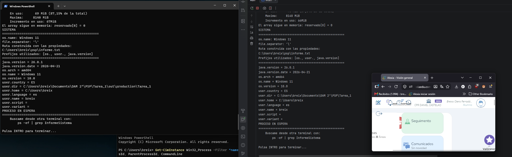
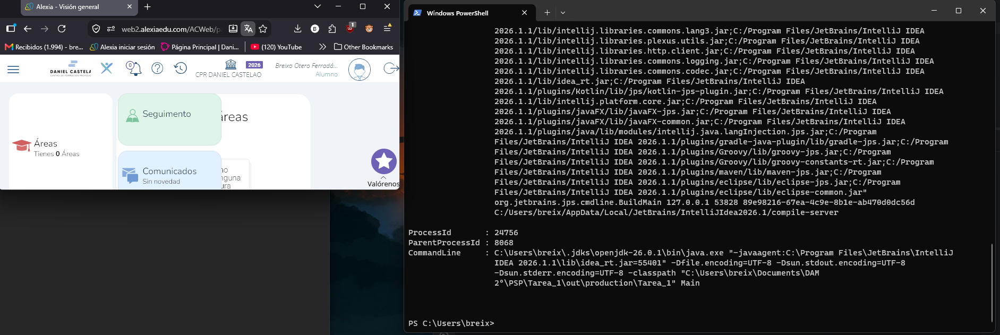
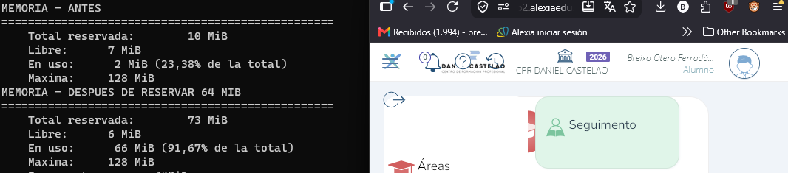
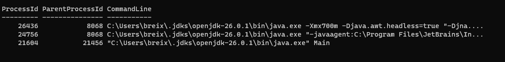

<h2>Capturas de las dos ejecuciones del programa:</h2>

<h2>Capturas de powershell</h2>

<h2>Comparaciones de las cifras de memoria</h2>

Cambia el valor de la memoria maxima utilizada y los otros valores siguen mas o menos igual, ya que este comando le indica a la JVM que reserve como máximo 128 MIB de memoria

<h2>Apartado 3</h2>

<ul>
<li>a) Un servidor web que atiende 500 peticiones a la vez en una máquina de 8 núcleos.</li>  
  Aqui encajaria la programacion paralela, ya que al dispones de una maquina con 8 nucleos reales, 
  el procesador puede ejecutar simultáneamente hasta 8 hilos de procesamiento en paralelo real. Inconvenientes: Condiciones de carrera y sobrecoste por cambio de contexto.
  
<li>b) Renderizar una película de animación en un plazo de tres meses.</li>  
  Este ejemplo puede solapar las 3 de cierta manera. La programacion distribuida por una parte, 
  ya que contar con varias maquinas interconectadas para que se repartan los fotogramas de la pelicula puede acelerar el proceso significativamente; 
  la programacion paralela puede aprovechar todos los nucleos físicos del procesador (o la GPU) para calcular pixeles en paralelo real, 
  y en la programacion concurrente, cada nodo gestiona tareas en segundo plano entrelazadas con el calculo intensivo. 
  Inconvenientes: La latencia de red y el sobrecoste de comunicacion entre los equipos.
  
<li>c) Una app de móvil que descarga un fichero mientras seguís navegando.</li>  
  La programacion concurrente encaja aqui ya que el objetivo principal no es calcular algo más rapido, sino mantener la interfaz de usuario responsiva mientras ocurre una tarea en segundo plano.
  Inconvenientes: Se pueden producir fallos de memoria (memory leaks) o excepciones al intentar modificar la UI desde un hilo secundario si se debe actualizar la UI pero el usuario ha cambiado de pantalla.
  
<li>d) Un cálculo que no cabe en la RAM de un solo equipo.</li>  
  La programacion distribuida encaja aqui, ya que al superar la capacidad fisica de memoria de un equipo individual, 
  la única solución viable es dividir los datos y la computación entre múltiples nodos físicos conectados en red. 
  Inconveniente: Cuello de botella en  la red y paso de mensajes. ya que al no compartir memoria fisica, 
  cualquier intercambio de datos intermedios entre maquinas debe viajas por cable de red, que es obviamente mas lente que la RAM local.
</ul>

<h2>Otras preguntas</h2>

El proceso padre es el 8068 al ser el ejecutable principal de IntelliJ IDEA (idea64.exe)

<ul>
<li>Repetid la búsqueda lanzando el programa de dos formas: desde la terminal y desde vuestro
IDE. ¿Cambia el PPID? ¿Por qué?</li>

Si, ya que ahora el programa no se esta ejecutando en el IDE, sino en el PowerShell de Windows en mi caso

<li>Ejecutadlo después con java -Xmx128m InformeSistema y comparad las cuatro cifras de
memoria con las de la ejecución normal. Indicad cuáles cambian, cuáles no y por qué</li>

Cambia el valor de la memeoria maxima utilizada y los otros valores siguen mas o menos igual, ya que este comando 	le indica a la JVM que reserve como máximo 128 MIB de memoria

<li>Por ultimo, indicad qué ruta genera vuestro programa en el apartado multiplataforma y qué
ruta generaría en el otro sistema operativo, explicando de dónde sale la diferencia.</li>
	<ul>
  <li>En mi S.O actual la ruta es:
		C:\Users\breix\Documents\DAM 2º\PSP\Tarea_1</li>

  <li>En otro S.O, como Linux seria:
		/home/breix/Documents/DAM 2º/PSP/Tarea_1</li>

  <li>La diferencia entre ambas rutas se debe a la arquitectura de cada S.O en tres aspectos clave:</li>
		-el caracter separador de carpetas (Windows "\" || Linux "/: )  
		-la estructura de la raiz (Windows "C:" || Linux "/")  
		-la ubicacion del directorio personal del usuario (Windows C:\Users\<Usuario>\ || Linux /home/<usuario>/)  
    </ul>
</ul>
